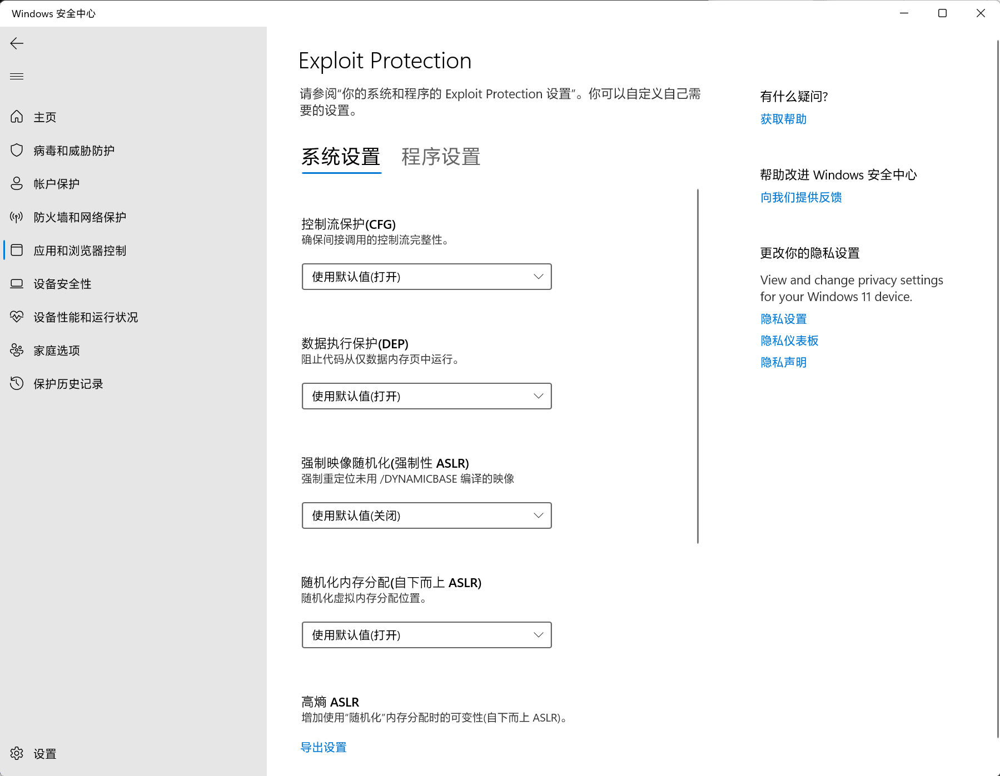

## 打开功能

```ps1
dism.exe /online /enable-feature /featurename:Microsoft-Windows-Subsystem-Linux /all /norestart
dism.exe /online /enable-feature /featurename:VirtualMachinePlatform /all /norestart
```

## 关闭功能

```ps1
DISM /online /disable-feature /featurename:VirtualMachinePlatform /norestart
DISM /online /disable-feature /featurename:Microsoft-Windows-Subsystem-Linux /norestart
```

## 启动虚拟机服务

```ps1
sc config vmms start=auto
sc start vmms
```

## 保持默认值

千万别关了，折腾半天，都想重装系统了。



# WSL2 更新包

```ps1
https://wslstorestorage.blob.core.windows.net/wslblob/wsl_update_x64.msi
```

```ps1
wsl --update
```

```ps1
wsl --set-default-version 2
```

其他见 Linux 学习笔记部分 WSL 相关。
